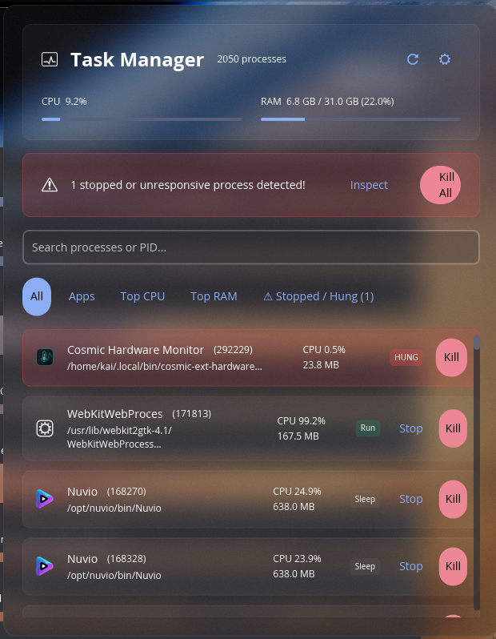

<div align="center">


# COSMIC MINI TASK MANAGER

**Find what's eating your CPU and kill it, from the COSMIC panel.**


🇬🇧 · 🇫🇷 · 🇩🇪 · 🇪🇸 · 🇮🇹 · 🇵🇹 · 🇯🇵 · 🇨🇳



</div>

---

A small process monitor that lives in the COSMIC panel. Click it and you get CPU and
memory usage, a list of what's running, and buttons to stop, resume, or kill anything
misbehaving — without opening a full system monitor or reaching for `htop`.

It exists because the thing I actually wanted from a task manager, 95% of the time,
was "which process is eating my CPU, and can I kill it right now".

## What it does

The panel button shows current CPU usage. It goes amber past 75%, and if something is
stopped or unresponsive it turns red and shows a count instead — so you notice without
opening anything.

Inside the popup:

- **CPU and memory meters** for the whole system, refreshed on a timer.
- **Five tabs.** *All* and *Apps* sort by CPU but float anything stopped or hung to the
  top. *Top CPU* and *Top RAM* sort purely by that one column. *Stopped / Hung* shows
  only the processes worth worrying about.
- **Search** across process name, full command line, and PID.
- **Per-process actions.** Stop (`SIGSTOP`), Resume (`SIGCONT`), Kill (`SIGKILL`).
  Which buttons appear depends on the state — a stopped process offers Resume, a zombie
  only offers Kill.
- **Kill takes the whole tree.** Killing a process kills its children and their children
  too, so you don't get orphans left running. Killing a browser or a file manager takes
  its helper processes with it instead of stranding them.
- **Kill All**, in the warning banner, for when several things have wedged at once.

GUI applications are matched against installed `.desktop` files, so they show their
real name and icon instead of a binary name. Everything else gets a generic icon.

## Installing

### Arch, CachyOS, and other Arch-based distros

```bash
git clone https://github.com/Kai-J-G/Cosmic-Mini-TaskManager.git
cd Cosmic-Mini-TaskManager
makepkg -si
```

This builds a release binary and installs it, plus the desktop entry, AppStream
metadata, icons, and licence, under `/usr`.

### With `just`

Installs into `~/.local`, no root needed:

```bash
just install
```

System-wide instead:

```bash
sudo just prefix=/usr install
```

And to remove it:

```bash
just uninstall
```

### With cargo directly

```bash
cargo build --release
install -Dm0755 target/release/cosmic-mini-taskmanager ~/.local/bin/cosmic-mini-taskmanager
install -Dm0644 data/io.github.kai_j_g.CosmicMiniTaskManager.desktop ~/.local/share/applications/io.github.kai_j_g.CosmicMiniTaskManager.desktop
install -Dm0644 data/io.github.kai_j_g.CosmicMiniTaskManager.metainfo.xml ~/.local/share/metainfo/io.github.kai_j_g.CosmicMiniTaskManager.metainfo.xml
install -Dm0644 data/icons/io.github.kai_j_g.CosmicMiniTaskManager.svg ~/.local/share/icons/hicolor/scalable/apps/io.github.kai_j_g.CosmicMiniTaskManager.svg
install -Dm0644 data/icons/io.github.kai_j_g.CosmicMiniTaskManager-symbolic.svg ~/.local/share/icons/hicolor/scalable/apps/io.github.kai_j_g.CosmicMiniTaskManager-symbolic.svg
```

## Adding it to the panel

Open COSMIC Settings, then **Desktop → Panel → Applets**, click **Add Applet**, and pick
**Mini Task Manager**. Drag it wherever you want it.

You can also just run `cosmic-mini-taskmanager` from a terminal, which gives you the
panel button as a floating window — useful for checking a build, less useful day to day.

## Settings

Click the gear in the popup header:

| Setting | Options | Default |
| --- | --- | --- |
| Appearance | System, Dark, Light | System |
| Refresh interval | 1s, 2s, 5s | 2s |
| Panel warning indicator | on / off | on |

Settings are stored via `cosmic-config`, so they survive restarts. Picking Dark or Light
pins the popup to that theme even if you later flip the desktop's own light/dark switch;
System follows the desktop.

## Languages

Eight languages, as embedded Fluent catalogs — no runtime files to install. The desktop's
language is picked up automatically, falling back to English.

English · Français · Deutsch · Español · Italiano · Português · 日本語 · 简体中文

Translations live in [`i18n/`](i18n). To add one, copy `i18n/en/cosmic_mini_taskmanager.ftl`
into a new locale directory and translate the values. A test asserts that every catalog
defines every message English does, so a partial translation fails `cargo test` rather
than falling back to English mid-sentence.

## Things worth knowing

- **You can only signal your own processes.** Anything owned by root or another user
  returns "Operation not permitted", which shows up in the status line at the foot of
  the popup. The applet doesn't ask for privilege escalation.
- **Kill is `SIGKILL`, and it takes descendants with it.** There's no "terminate
  gracefully first" step, so nothing killed this way saves its work. That's deliberate —
  it's the button you press when asking nicely has already failed. The descendant list is
  captured before the root dies, since children are reparented to init the moment it
  does. Note that killing something far up the tree takes everything under it: kill your
  session leader and you end your session.
- **CPU is a share of the whole machine, not of one core.** A single-threaded process
  pegging one core on a 16-core box reads as about 6%, not 100%, so the rows add up to
  the figure in the header. If you're used to `htop`'s per-core numbers, multiply by your
  core count.
- **Threads aren't listed separately.** `sysinfo` reports them alongside processes on
  Linux, and a userland thread carries its process's command line — so they used to
  appear as duplicate rows with their CPU counted twice.
- **"Hung" means two consecutive polls in uninterruptible sleep.** A single poll in `D`
  state is just a normal disk read, so a process has to stay there to get flagged.
- **The list renders at most 80 rows.** The toolkit builds every widget in the tree each
  frame, so an unbounded list would cost real frame time on a machine with hundreds of
  processes. The tabs and the search box are how you reach the rest.
- **Kernel threads are hidden.** They have no command line and aren't yours to manage.
- Memory is reported in binary units (MiB, GiB), matching what the kernel reports.
- Swap isn't shown anywhere.

## Building from source

Needs a Rust toolchain and the usual COSMIC build dependencies.

```bash
cargo build --release
```

```bash
cargo test
```

The test suite covers signal dispatch, process-tree walking, filtering and sort ordering,
byte formatting, translation completeness, and building the full widget tree for every tab
against deliberately hostile process data — long command lines, multi-byte characters,
`NaN` CPU values, and empty names.

Two tests spawn a real three-level process tree: one asserts that killing only the root
*does* leave orphans, the other that the sweep doesn't. The first exists so the second
can't quietly stop proving anything.

## Layout

```
src/
├── main.rs                 entry point
├── app.rs                  state, update loop, subscriptions
├── config.rs               persisted settings
├── localize.rs             Fluent catalog loading
├── process/
│   ├── types.rs            process, state, and overview models; process-tree walk
│   ├── collector.rs        sysinfo polling, .desktop matching, filtering, sorting
│   └── actions.rs          SIGSTOP / SIGCONT / SIGKILL
└── views/
    ├── mod.rs              popup composition
    ├── panel.rs            panel button and popup surface
    ├── header.rs           CPU and RAM meters
    ├── filter_bar.rs       search and tabs
    ├── alert_banner.rs     warning banner and Kill All
    ├── process_row.rs      one process row
    ├── settings.rs         settings panel
    └── style.rs            container and badge styling
```

Built on [libcosmic](https://github.com/pop-os/libcosmic), which means the Elm-style
model/update/view pattern from `iced`. Process data comes from
[sysinfo](https://github.com/GuillaumeGomez/sysinfo).

## Ideas for later

Per-process disk and network I/O. A collapsible parent/child process tree in the list
itself. Cgroup CPU and memory limits, so you could throttle something instead of killing
it. A global shortcut to summon the popup.

## Licence

MIT — see [LICENSE](LICENSE).

Dependencies keep their own licences. The two that matter most here are
[libcosmic](https://github.com/pop-os/libcosmic), which is **MPL-2.0**, and
[sysinfo](https://github.com/GuillaumeGomez/sysinfo), which is MIT. MPL-2.0 is
file-level copyleft: linking it into this MIT-licensed binary is fine, but if you
modify libcosmic's own source you have to publish those changes. `cargo tree` will
show you the full dependency set.
